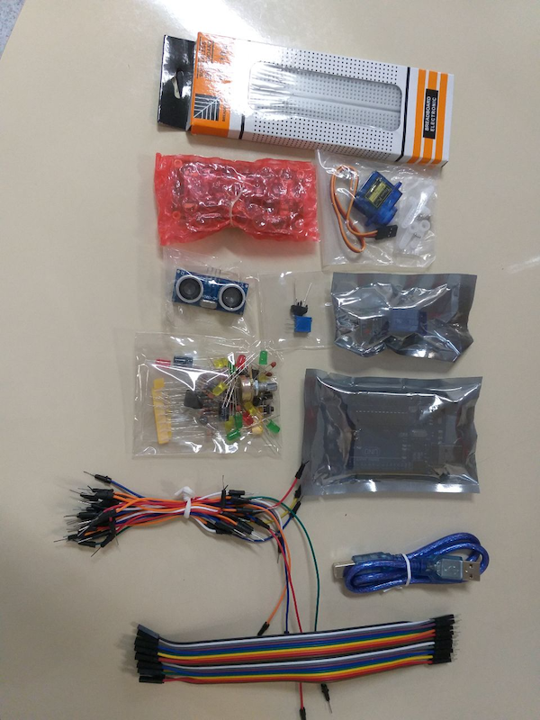

# Brusque

Encontro entre [IFSC câmpus São José](https://www.ifsc.edu.br/web/campus-sao-jose) e [Prefeitura Municipal de Brusque](http://www.brusque.sc.gov.br/) no [Centro Municipal de Inclusão Digital (CMID)](https://goo.gl/maps/yyNzhhUnHfFX87FP8).

## Kits Arduino

São 25 kits Arduino com [componentes selecionados pela Eletrogate](https://www.eletrogate.com/kit-beginning) - [com apostila](https://conteudo.eletrogate.com/apostila-arduino-beginning).

## Endereços Úteis

Jogos recomendados para raciocínio lógico:

- [Lightbot](http://lightbot.com) ([Android](https://play.google.com/store/apps/details?id=com.lightbot.lightbot) e [iOS](https://itunes.apple.com/us/app/lightbot-programming-puzzles/id657638474?mt=8))
- [Mekorama](http://www.mekorama.com) ([Android](https://play.google.com/store/apps/details?id=com.martinmagni.mekorama) e [iOS](https://itunes.apple.com/br/app/mekorama/id1079464948?mt=8))
- [Lumino City](http://www.luminocitygame.com) ([Android](https://play.google.com/store/apps/details?id=air.com.noodlecake.luminocity&hl=pt_BR) e [iOS](https://itunes.apple.com/br/app/lumino-city/id958604518?mt=8))
- [Monument Valley](https://www.ustwo.com/work/monument-valley-mobile-games) ([Android](https://play.google.com/store/apps/details?id=com.ustwo.monumentvalley&hl=pt_BR) e [iOS](https://itunes.apple.com/br/app/monument-valley/id728293409?mt=8))
- [Monument Valley 2](https://www.ustwo.com/work/monument-valley-mobile-games) ([Android](https://play.google.com/store/apps/details?id=com.ustwo.monumentvalley2&hl=pt_BR) e [iOS](https://itunes.apple.com/br/app/monument-valley-2/id1187265767?mt=8))
- [Minecraft](https://www.minecraft.net/pt-br/) ([Android](https://play.google.com/store/apps/details?id=com.mojang.minecraftpe) e [iOS](https://itunes.apple.com/br/app/minecraft/id479516143?mt=8))
- [Sevn](https://spielstein.com/apps/sevn) ([iOS](https://itunes.apple.com/us/app/sevn/id1179097907?mt=8))

Ferramentas para escolas:

- [Minecraft Education](https://education.minecraft.net)

Introdução a programação:

- [Minecraft Education](https://education.minecraft.net)
- [Code.org](https://code.org)
- [Scratch](https://scratch.mit.edu)
- [Micro:bit](https://makecode.microbit.org)

Projetos com Arduino:

- [Hackster](https://www.hackster.io/arduino)
- [Instructables](https://www.instructables.com/circuits/arduino/projects/)
